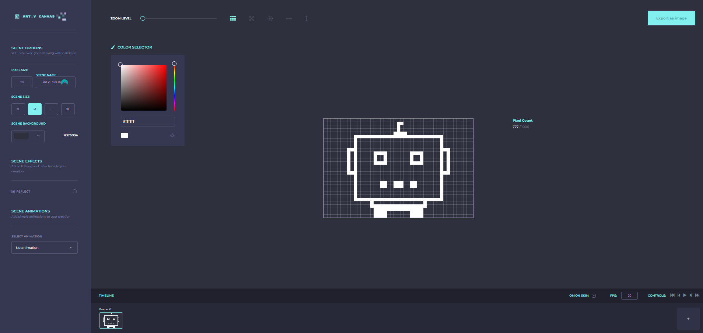

# ART.V Pixel Canvas



## Overview

**ART.V Pixel Canvas** is an interactive pixel art tool that allows users to create pixel art scenes with a variety of customizable options, including pixel size, scene size, background color, and scene effects. Users can also apply simple animations to their scenes and export their artwork as an image.

## Features

- **Pixel Size Adjustment**: Choose from different pixel sizes to create your artwork.
- **Scene Size Options**: Select from multiple scene sizes (S, M, L, XL) to fit your creative needs.
- **Color Selector**: Easily pick and apply colors to your pixel art using an integrated color picker.
- **Scene Effects**: Add dithering and reflections to enhance your artwork.
- **Scene Animations**: Apply basic animations like spin, bounce, and wobble to your scene.
- **Grid and Pan Tools**: Utilize grid toggling, panning, and centering tools for easier editing.
- **Export as Image**: Export your completed scene as a PNG image.

## How to Use

1. **Setup**: Clone this repository and ensure all required dependencies are installed.
2. **Run Locally**: Open the `index.html` file in your preferred web browser to start creating pixel art.
3. **Customization**: Use the scene options panel to customize the size, background color, and effects of your scene.
4. **Create & Animate**: Start drawing on the canvas, add effects, and apply animations as desired.
5. **Export**: Once your artwork is complete, use the "Export as Image" option to save your creation.

## Requirements

- A modern web browser (Chrome, Firefox, Safari, etc.)
- No additional software installations are required.

## Installation

```bash
git clone https://github.com/DeFi-Vandelay/ART.V-Pixel-Canvas.git
cd ART.V-Pixel-Canvas
